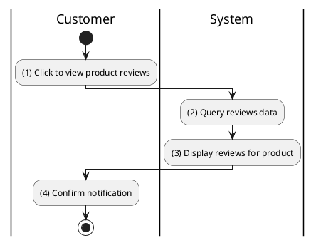

# Activity View Product Reviews

```plantuml
@startuml
|C|Customer
|S|System

|C|
start
:(1) Click to view product reviews;
|S|
:(2) Query reviews data;
:(3) Display reviews for product;
|C|
:(4) Confirm notification;
stop
@enduml
```

<!-- diagram id="activity-view-product-view-product-reviews" -->