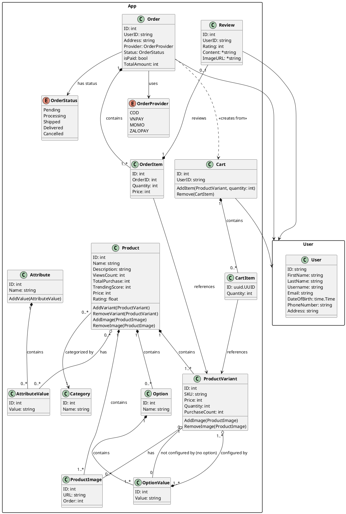

# Class Diagram

```plantuml
@startuml E-Commerce Domain Model

skinparam classFontStyle bold
skinparam classAttributeIconSize 0
skinparam packageStyle rectangle
/' skinparam linetype ortho '/
/' skinparam linetype polyline '/

package "User" {
    class User {
        ID: string
        FirstName: string
        LastName: string
        Username: string
        Email: string
        DateOfBirth: time.Time
        PhoneNumber: string
        Address: string
    }
}

package "App" {

    ' ----- Category -----
    class Category {
        ID: int
        Name: string
    }

    ' ----- Product and Related -----
    class Product {
        ID: int
        Name: string
        Description: string
        ViewsCount: int
        TotalPurchase: int
        TrendingScore: int
        Price: int
        Rating: float
        AddVariant(ProductVariant)
        RemoveVariant(ProductVariant)
        AddImage(ProductImage)
        RemoveImage(ProductImage)
    }

    class Option {
        ID: int
        Name: string
    }

    class OptionValue {
        ID: int
        Value: string
    }

    class ProductVariant {
        ID: int
        SKU: string
        Price: int
        Quantity: int
        PurchaseCount: int
        AddImage(ProductImage)
        RemoveImage(ProductImage)
    }

    class ProductImage {
        ID: int
        URL: string
        Order: int
    }

    class Attribute {
        ID: int
        Name: string
        AddValue(AttributeValue)
    }

    class AttributeValue {
        ID: int
        Value: string
    }

    ' ----- Cart -----
    class Cart {
        ID: int
        UserID: string
        AddItem(ProductVariant, quantity: int)
        Remove(CartItem)
    }

    class CartItem {
        ID: uuid.UUID
        Quantity: int
    }

    ' ----- Order -----
    class Order {
        ID: int
        UserID: string
        Address: string
        Provider: OrderProvider
        Status: OrderStatus
        isPaid: bool
        TotalAmount: int
    }

    enum OrderStatus {
        Pending
        Processing
        Shipped
        Delivered
        Cancelled
    }

    class OrderItem {
        ID: int
        OrderID: int
        Quantity: int
        Price: int
    }

    enum OrderProvider {
        COD
        VNPAY
        MOMO
        ZALOPAY
    }

    ' ----- Review -----
    class Review {
        ID: int
        UserID: string
        Rating: int
        Content: *string
        ImageURL: *string
    }

    ' ===== Relationships =====

    ' Product Composition (diamond filled)
    Product "1" *--- "0..*" Option : contains
    Product "1" *--- "1..*" ProductVariant : contains
    Product "1" *--- "1..*" ProductImage : contains

    ' Option Composition
    Option "1" *--- "1..*" OptionValue : contains

    ' Product Aggregation
    Product "0..*" o--- "0..*" AttributeValue : has

    ' ProductVariant relationships
    ProductVariant "0" --- "0" OptionValue : not configured by (no option)
    ProductVariant "1..*" o---* "1..*" OptionValue : configured by
    ProductVariant "1" o--- "0..*" ProductImage : has

    ' Category relationship
    Product "0..*" ---> "1" Category : categorized by

    ' Attribute relationships
    Attribute "1" *--- "0..*" AttributeValue : contains

    ' Cart relationships
    Cart "1" *--- "0..*" CartItem : contains
    CartItem ---> ProductVariant : references

    ' Order relationships
    Order "1" *--- "1..*" OrderItem : contains
    OrderItem ---> ProductVariant : references

    ' Order depends on Cart (dependency)
    Order ...> Cart : <<creates from>>
    Order --> OrderProvider : uses
    Order --> OrderStatus : has status

    ' Review relationships
    Review "0..1" ---* "1" OrderItem : reviews
}

' ===== User References (by ID only) =====
Cart ---> User
Order ---> User
Review ---> User

@enduml
```

<!-- diagram id="class-diagram" -->
