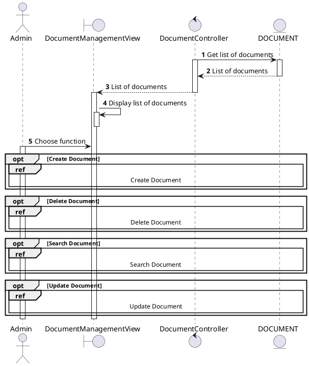

# Sequence Adjust Document

```plantuml
@startuml
autonumber

actor Admin as A
boundary DocumentManagementView as DMV
control DocumentController as DC
entity DOCUMENT as D

DC -> D: Get list of documents
activate DC
activate D
DC <-- D: List of documents
deactivate D
DMV <-- DC: List of documents
deactivate DC
activate DMV
DMV -> DMV: Display list of documents
activate DMV
deactivate DMV

A -> DMV: Choose function
activate A

opt Create Document
  ref over A, D: Create Document
end

opt Delete Document
  ref over A, D: Delete Document
end

opt Search Document
  ref over A, D: Search Document
end

opt Update Document
  ref over A, D: Update Document
end

deactivate DMV
deactivate A

@enduml
```

<!-- diagram id="sequence-adjust-document-adjust-document" -->
