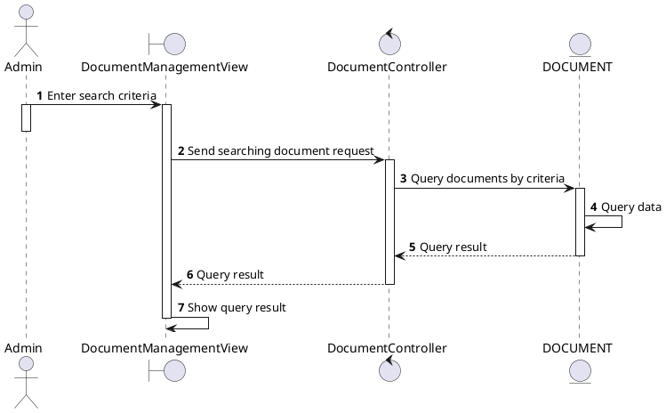

# Sequence Search Document

```plantuml
@startuml
autonumber

actor Admin as A
boundary DocumentManagementView as DMV
control DocumentController as DC
entity DOCUMENT as D

A -> DMV: Enter search criteria
activate A
activate DMV
deactivate A
DMV -> DC: Send searching document request
activate DC
DC -> D: Query documents by criteria
activate D
D -> D: Query data
DC <-- D: Query result
deactivate D
DMV <-- DC: Query result
deactivate DC
DMV -> DMV: Show query result
deactivate DMV

@enduml
```

<!-- diagram id="sequence-adjust-document-search-document" -->
