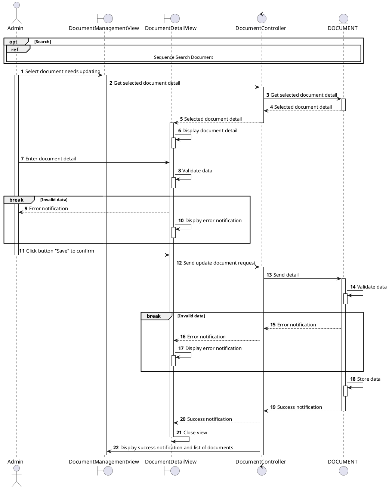

# Sequence Update Document

```plantuml
@startuml
autonumber

actor Admin as A
boundary DocumentManagementView as DMV
boundary DocumentDetailView as DDV
control DocumentController as DC
entity DOCUMENT as D

opt Search
  ref over A, D: Sequence Search Document
end
A -> DMV: Select document needs updating
activate A
activate DMV
DMV -> DC: Get selected document detail
activate DC
DC -> D: Get selected document detail
activate D
DC <-- D: Selected document detail
deactivate D
DDV <-- DC: Selected document detail
deactivate DC
activate DDV
DDV -> DDV: Display document detail
activate DDV
deactivate DDV
A -> DDV: Enter document detail
DDV -> DDV: Validate data
activate DDV
deactivate DDV
break Invalid data
  A <-- DDV: Error notification
  DDV -> DDV: Display error notification
  activate DDV
  deactivate DDV
end
A -> DDV: Click button "Save" to confirm
deactivate A
DDV -> DC: Send update document request
activate DC
DC -> D: Send detail
activate D
D -> D: Validate data
activate D
deactivate D
break Invalid data
  DC <-- D: Error notification
  DDV <-- DC: Error notification
  DDV -> DDV: Display error notification
  activate DDV
  deactivate DDV
end
D -> D: Store data
activate D
deactivate D
DC <-- D: Success notification
deactivate D
DDV <-- DC: Success notification
DDV -> DDV: Close view
deactivate DDV
DMV <- DC: Display success notification and list of documents

@enduml
```

<!-- diagram id="sequence-adjust-document-update-document" -->
