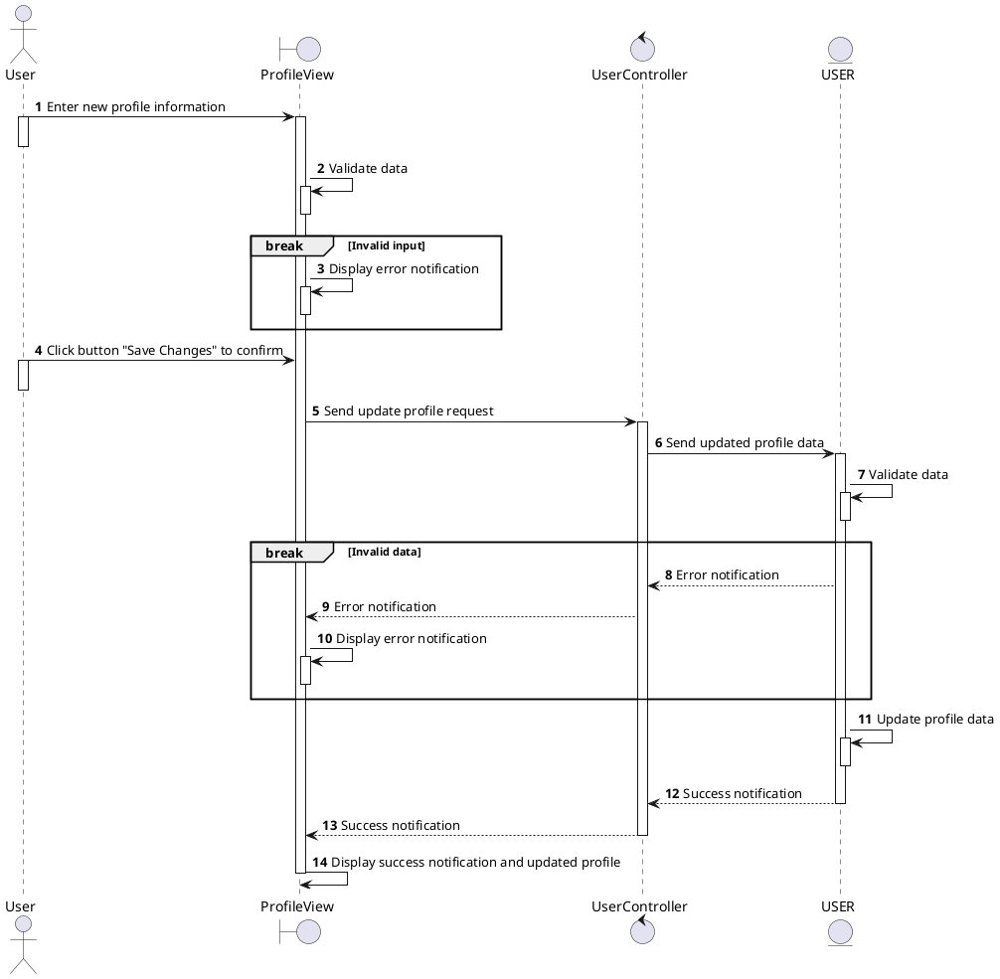

# Sequence Edit Profile

```plantuml
@startuml
autonumber

actor User as U
boundary ProfileView as PV
control UserController as UC
entity USER as Us

U -> PV: Enter new profile information
activate U
activate PV
deactivate U
PV -> PV: Validate data
activate PV
deactivate PV
break Invalid input
  PV -> PV: Display error notification
  activate PV
  deactivate PV
end
U -> PV: Click button "Save Changes" to confirm
activate U
deactivate U
PV -> UC: Send update profile request
activate UC
UC -> Us: Send updated profile data
activate Us
Us -> Us: Validate data
activate Us
deactivate Us
break Invalid data
  UC <-- Us: Error notification
  PV <-- UC: Error notification
  PV -> PV: Display error notification
  activate PV
  deactivate PV
end
Us -> Us: Update profile data
activate Us
deactivate Us
UC <-- Us: Success notification
deactivate Us
PV <-- UC: Success notification
deactivate UC
PV -> PV: Display success notification and updated profile
deactivate PV

@enduml
```

<!-- diagram id="sequence-manage-account-edit-profile" -->