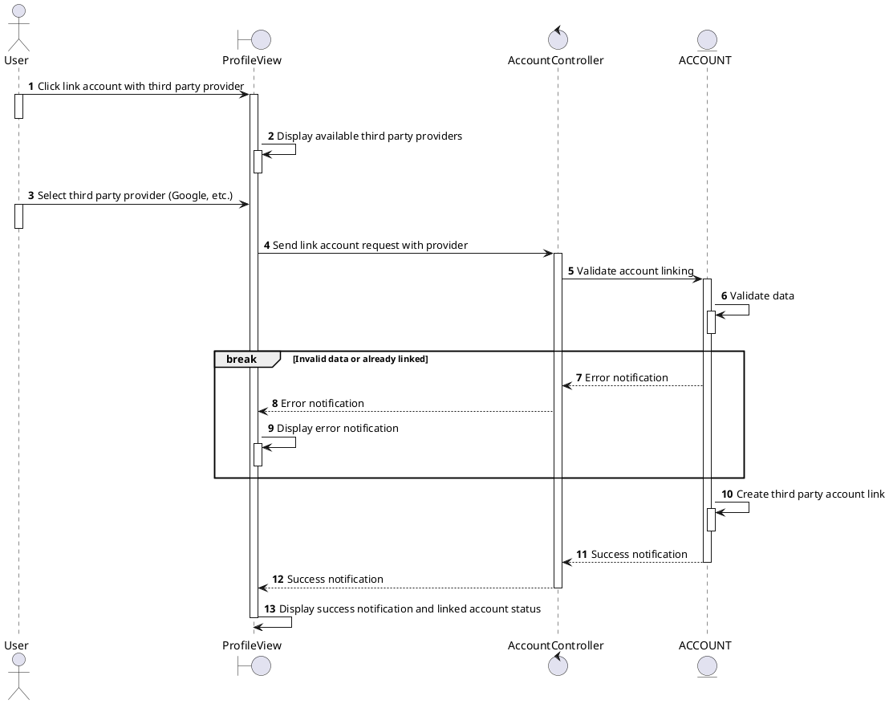

# Sequence Link Account With Third Party

```plantuml
@startuml
autonumber

actor User as U
boundary ProfileView as PV
control AccountController as AC
entity ACCOUNT as A

U -> PV: Click link account with third party provider
activate U
activate PV
deactivate U
PV -> PV: Display available third party providers
activate PV
deactivate PV
U -> PV: Select third party provider (Google, etc.)
activate U
deactivate U
PV -> AC: Send link account request with provider
activate AC
AC -> A: Validate account linking
activate A
A -> A: Validate data
activate A
deactivate A
break Invalid data or already linked
  AC <-- A: Error notification
  PV <-- AC: Error notification
  PV -> PV: Display error notification
  activate PV
  deactivate PV
end
A -> A: Create third party account link
activate A
deactivate A
AC <-- A: Success notification
deactivate A
PV <-- AC: Success notification
deactivate AC
PV -> PV: Display success notification and linked account status
deactivate PV

@enduml
```

<!-- diagram id="sequence-manage-account-link-account-with-third-party" -->