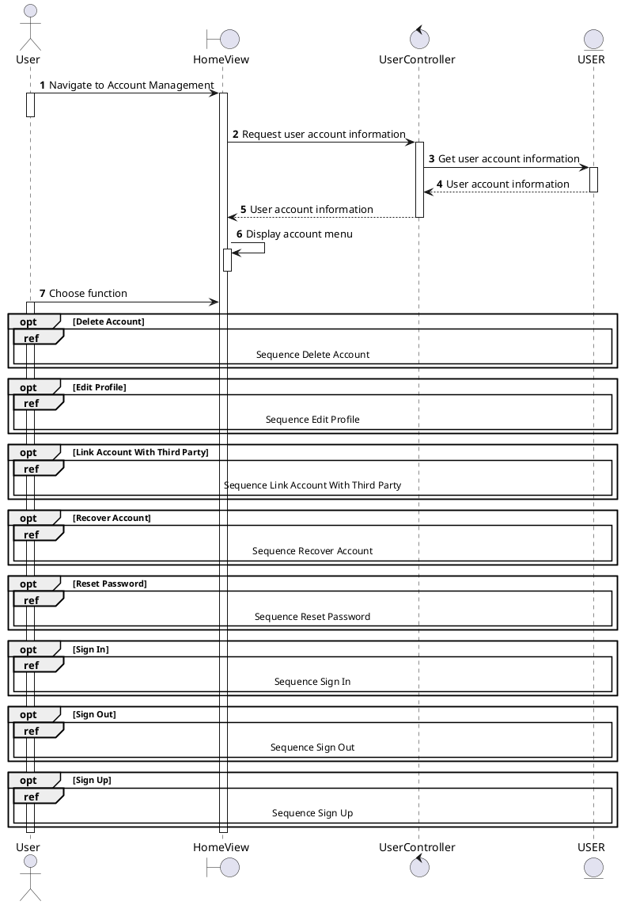

# Sequence Manage Account

```plantuml
@startuml
autonumber

actor User as U
boundary HomeView as HV
control UserController as UC
entity USER as Us

U -> HV: Navigate to Account Management
activate U
activate HV
deactivate U
HV -> UC: Request user account information
activate UC
UC -> Us: Get user account information
activate Us
UC <-- Us: User account information
deactivate Us
HV <-- UC: User account information
deactivate UC
HV -> HV: Display account menu
activate HV
deactivate HV

U -> HV: Choose function
activate U

opt Delete Account
  ref over U, Us: Sequence Delete Account
end

opt Edit Profile
  ref over U, Us: Sequence Edit Profile
end

opt Link Account With Third Party
  ref over U, Us: Sequence Link Account With Third Party
end

opt Recover Account
  ref over U, Us: Sequence Recover Account
end

opt Reset Password
  ref over U, Us: Sequence Reset Password
end

opt Sign In
  ref over U, Us: Sequence Sign In
end

opt Sign Out
  ref over U, Us: Sequence Sign Out
end

opt Sign Up
  ref over U, Us: Sequence Sign Up
end

deactivate HV
deactivate U

@enduml
```

<!-- diagram id="sequence-manage-account-manage-account" -->