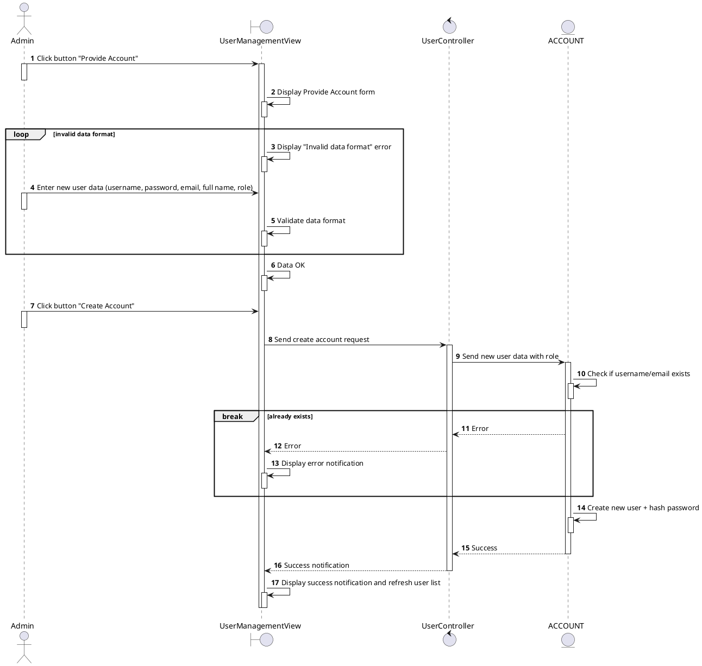

# Sequence Provide Account

```plantuml
@startuml
autonumber

actor Admin as A
boundary UserManagementView as UMV
control UserController as UC
entity ACCOUNT as AC

A -> UMV: Click button "Provide Account"
activate A
activate UMV
deactivate A
UMV -> UMV: Display Provide Account form
activate UMV
deactivate UMV

loop invalid data format
  UMV -> UMV: Display "Invalid data format" error
  activate UMV
  deactivate UMV
  A -> UMV: Enter new user data (username, password, email, full name, role)
  activate A
  deactivate A
  UMV -> UMV: Validate data format
  activate UMV
  deactivate UMV
end

UMV -> UMV: Data OK
activate UMV
deactivate UMV

A -> UMV: Click button "Create Account"
activate A
deactivate A

UMV -> UC: Send create account request
activate UC

UC -> AC: Send new user data with role
activate AC
AC -> AC: Check if username/email exists
activate AC
deactivate AC

break already exists
  UC <-- AC: Error
  UMV <-- UC: Error
  UMV -> UMV: Display error notification
  activate UMV
  deactivate UMV
end

AC -> AC: Create new user + hash password
activate AC
deactivate AC

UC <-- AC: Success
deactivate AC

UMV <-- UC: Success notification
deactivate UC

UMV -> UMV: Display success notification and refresh user list
activate UMV
deactivate UMV
deactivate UMV

@enduml
```

<!-- diagram id="sequence-manage-account-provide-account" -->
