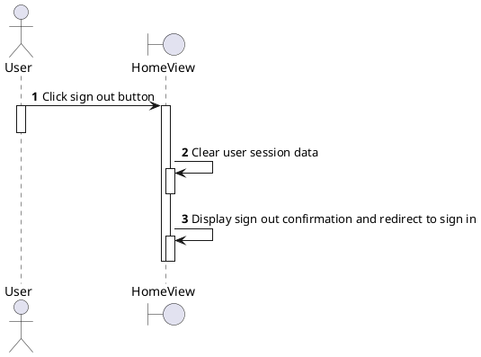

# Sequence Sign Out

```plantuml
@startuml
autonumber

actor User as U
boundary HomeView as HV

U -> HV: Click sign out button
activate U
activate HV
deactivate U
HV -> HV: Clear user session data
activate HV
deactivate HV
HV -> HV: Display sign out confirmation and redirect to sign in
activate HV
deactivate HV
deactivate HV

@enduml
```

<!-- diagram id="sequence-manage-account-sign-out" -->