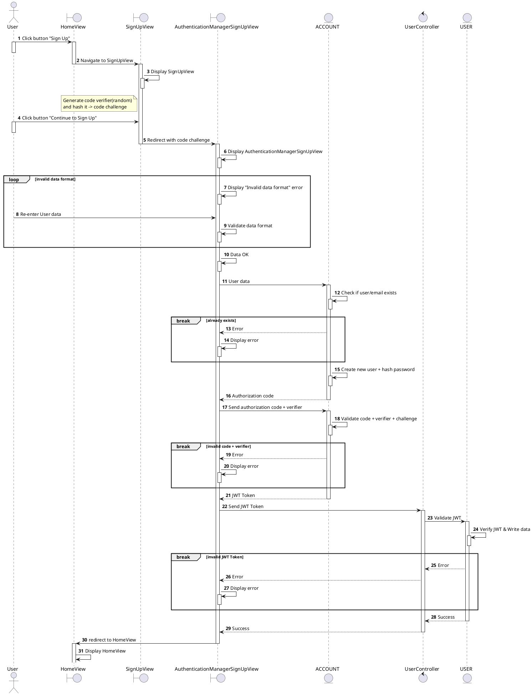

# Sequence Sign Up

```plantuml
@startuml
autonumber

actor User as U
boundary HomeView as HV
boundary SignUpView as SUV
boundary AuthenticationManagerSignUpView as AMSUV

entity ACCOUNT as A
control UserController as UC
entity USER as US

U -> HV: Click button "Sign Up"
activate U
activate HV
deactivate U
HV -> SUV: Navigate to SignUpView
deactivate HV
activate SUV
SUV -> SUV: Display SignUpView
activate SUV
deactivate SUV
note left of SUV: Generate code verifier(random)\nand hash it -> code challenge
U -> SUV: Click button "Continue to Sign Up"
activate U
deactivate U
SUV -> AMSUV: Redirect with code challenge
deactivate SUV
activate AMSUV
AMSUV -> AMSUV: Display AuthenticationManagerSignUpView
activate AMSUV
deactivate AMSUV

loop invalid data format
  AMSUV -> AMSUV: Display "Invalid data format" error
  activate AMSUV
  deactivate AMSUV
  U -> AMSUV: Re-enter User data
  deactivate U
  AMSUV -> AMSUV: Validate data format
  activate AMSUV
  deactivate AMSUV
end

AMSUV -> AMSUV: Data OK
activate AMSUV
deactivate AMSUV

AMSUV -> A: User data
activate A
A -> A: Check if user/email exists
activate A
deactivate A

break already exists
    AMSUV <-- A: Error
    AMSUV -> AMSUV: Display error
    activate AMSUV
    deactivate AMSUV
end

A -> A: Create new user + hash password
activate A
deactivate A
AMSUV <-- A: Authorization code
deactivate A

AMSUV -> A: Send authorization code + verifier
activate A
A -> A: Validate code + verifier + challenge
activate A
deactivate A

break invalid code + verifier
  AMSUV <-- A: Error
  AMSUV -> AMSUV: Display error
  activate AMSUV
  deactivate AMSUV
end

AMSUV <-- A: JWT Token
deactivate A

AMSUV -> UC: Send JWT Token
activate UC

UC -> US: Validate JWT
activate US
US -> US: Verify JWT & Write data
activate US
deactivate US

break invalid JWT Token
  UC <-- US: Error
  AMSUV <-- UC: Error
  AMSUV -> AMSUV: Display error
  activate AMSUV
  deactivate AMSUV
end

UC <-- US: Success
deactivate US
AMSUV <-- UC: Success
deactivate UC
HV <- AMSUV: redirect to HomeView
deactivate AMSUV
activate HV
deactivate HV
HV -> HV: Display HomeView
@enduml
```

<!-- diagram id="sequence-manage-account-sign-up" -->
