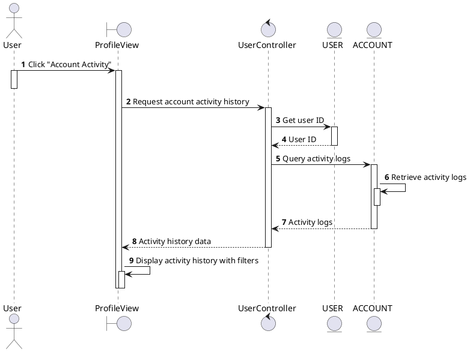

# Sequence View Account Activity

```plantuml
@startuml
autonumber

actor User as U
boundary ProfileView as PV
control UserController as UC
entity USER as Us
entity ACCOUNT as A

U -> PV: Click "Account Activity"
activate U
activate PV
deactivate U
PV -> UC: Request account activity history
activate UC
UC -> Us: Get user ID
activate Us
UC <-- Us: User ID
deactivate Us
UC -> A: Query activity logs
activate A
A -> A: Retrieve activity logs
activate A
deactivate A
UC <-- A: Activity logs
deactivate A
PV <-- UC: Activity history data
deactivate UC
PV -> PV: Display activity history with filters
activate PV
deactivate PV
deactivate PV

@enduml
```

<!-- diagram id="sequence-manage-account-view-account-activity" -->
