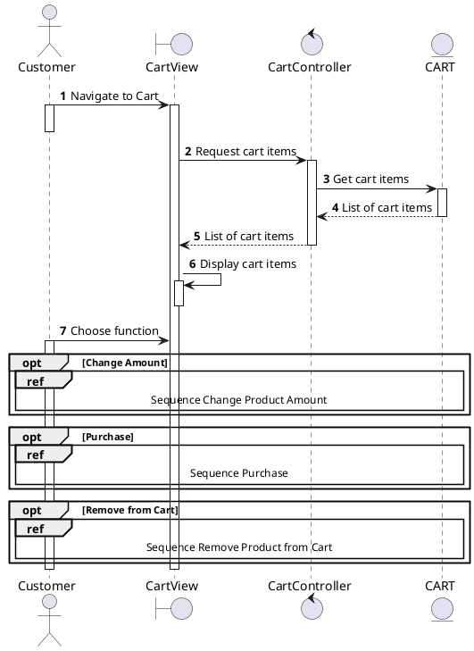

# Sequence Manage Cart

```plantuml
@startuml
autonumber

actor Customer as C
boundary CartView as CV
control CartController as CC
entity CART as Ca

C -> CV: Navigate to Cart
activate C
activate CV
deactivate C
CV -> CC: Request cart items
activate CC
CC -> Ca: Get cart items
activate Ca
CC <-- Ca: List of cart items
deactivate Ca

CV <-- CC: List of cart items
deactivate CC
CV -> CV: Display cart items
activate CV
deactivate CV

C -> CV: Choose function
activate C

opt Change Amount
  ref over C, Ca: Sequence Change Product Amount
end

opt Purchase
  ref over C, Ca: Sequence Purchase
end

opt Remove from Cart
  ref over C, Ca: Sequence Remove Product from Cart
end

deactivate CV
deactivate C

@enduml
```

<!-- diagram id="sequence-manage-cart-manage-cart" -->
