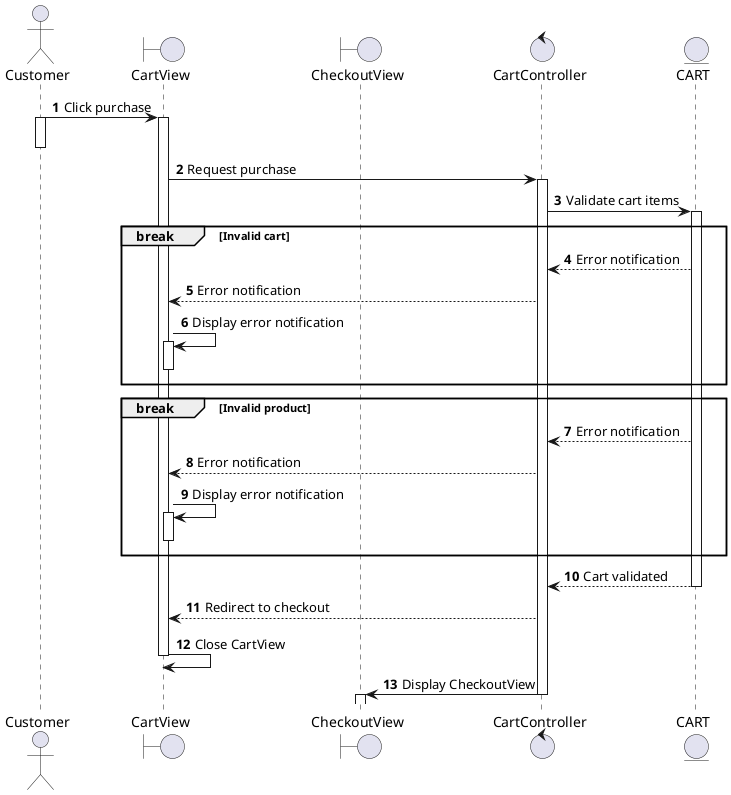

# Sequence Purchase

```plantuml
@startuml
autonumber

actor Customer as C
boundary CartView as CaV
boundary CheckoutView as ChV
control CartController as CC
entity CART as Ca

C -> CaV: Click purchase
activate C
activate CaV
deactivate C
CaV -> CC: Request purchase
activate CC
CC -> Ca: Validate cart items
activate Ca

break Invalid cart
  CC <-- Ca: Error notification
  CaV <-- CC: Error notification
  CaV -> CaV: Display error notification
  activate CaV
  deactivate CaV
end

break Invalid product
  CC <-- Ca: Error notification
  CaV <-- CC: Error notification
  CaV -> CaV: Display error notification
  activate CaV
  deactivate CaV
end

CC <-- Ca: Cart validated
deactivate Ca
CaV <-- CC: Redirect to checkout
CaV -> CaV: Close CartView
deactivate CaV
ChV <- CC: Display CheckoutView
deactivate CC
activate ChV
deactivate ChV

@enduml
```

<!-- diagram id="sequence-manage-cart-purchase" -->
