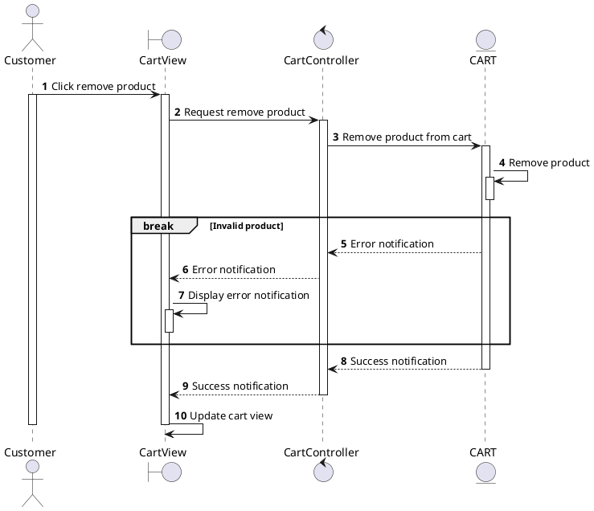

# Sequence Remove Product from Cart

```plantuml
@startuml
autonumber

actor Customer as C
boundary CartView as CV
control CartController as CC
entity CART as Ca

C -> CV: Click remove product
activate C
activate CV
CV -> CC: Request remove product
activate CC
CC -> Ca: Remove product from cart
activate Ca
Ca -> Ca: Remove product
activate Ca
deactivate Ca
break Invalid product
  CC <-- Ca: Error notification
  CV <-- CC: Error notification
  CV -> CV: Display error notification
  activate CV
  deactivate CV
end
CC <-- Ca: Success notification
deactivate Ca
CV <-- CC: Success notification
deactivate CC
CV -> CV: Update cart view
deactivate CV
deactivate C

@enduml
```

<!-- diagram id="sequence-manage-cart-remove-product-from-cart" -->
