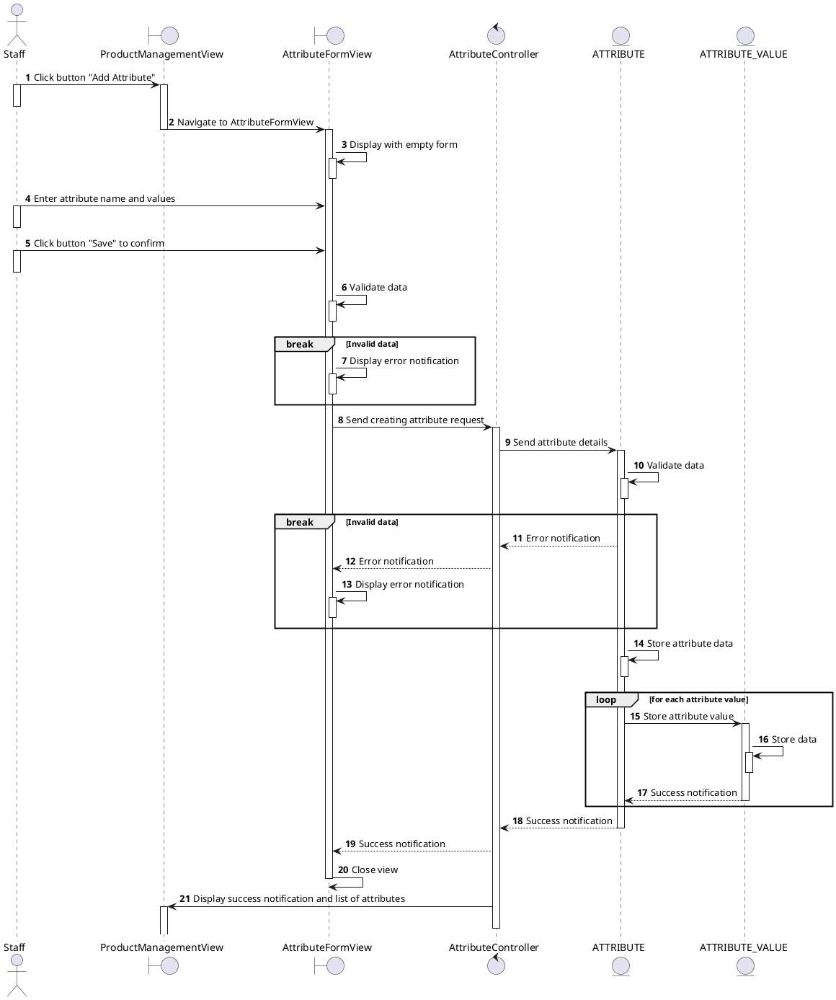

# Sequence Add Attribute

```plantuml
@startuml
autonumber

actor Staff as S
boundary ProductManagementView as PMV
boundary AttributeFormView as AFV
control AttributeController as AC
entity ATTRIBUTE as A
entity ATTRIBUTE_VALUE as AV

S -> PMV: Click button "Add Attribute"
activate S
activate PMV
deactivate S
PMV -> AFV: Navigate to AttributeFormView
deactivate PMV
activate AFV
AFV -> AFV: Display with empty form
activate AFV
deactivate AFV
S -> AFV: Enter attribute name and values
activate S
deactivate S
S -> AFV: Click button "Save" to confirm
activate S
deactivate S
AFV -> AFV: Validate data
activate AFV
deactivate AFV
break Invalid data
  AFV -> AFV: Display error notification
  activate AFV
  deactivate AFV
end
AFV -> AC: Send creating attribute request
activate AC
AC -> A: Send attribute details
activate A
A -> A: Validate data
activate A
deactivate A
break Invalid data
  AC <-- A: Error notification
  AFV <-- AC: Error notification
  AFV -> AFV: Display error notification
  activate AFV
  deactivate AFV
end
A -> A: Store attribute data
activate A
deactivate A
loop for each attribute value
  A -> AV: Store attribute value
  activate AV
  AV -> AV: Store data
  activate AV
  deactivate AV
  A <-- AV: Success notification
  deactivate AV
end
AC <-- A: Success notification
deactivate A
AFV <-- AC: Success notification
AFV -> AFV: Close view
deactivate AFV
PMV <- AC: Display success notification and list of attributes
activate PMV
deactivate AC

@enduml
```

<!-- diagram id="sequence-manage-product-add-attribute" -->
