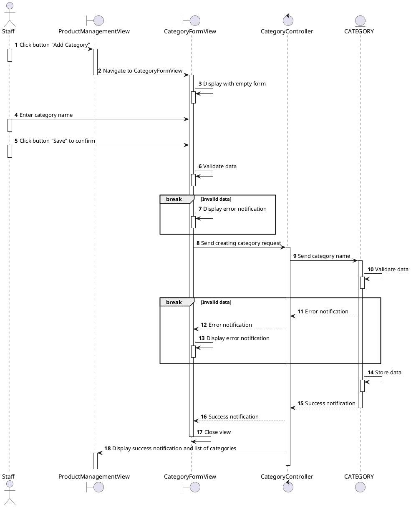

# Sequence Add Category

```plantuml
@startuml
autonumber

actor Staff as S
boundary ProductManagementView as PMV
boundary CategoryFormView as CFV
control CategoryController as CC
entity CATEGORY as C

S -> PMV: Click button "Add Category"
activate S
activate PMV
deactivate S
PMV -> CFV: Navigate to CategoryFormView
deactivate PMV
activate CFV
CFV -> CFV: Display with empty form
activate CFV
deactivate CFV
S -> CFV: Enter category name
activate S
deactivate S
S -> CFV: Click button "Save" to confirm
activate S
deactivate S
CFV -> CFV: Validate data
activate CFV
deactivate CFV
break Invalid data
  CFV -> CFV: Display error notification
  activate CFV
  deactivate CFV
end
CFV -> CC: Send creating category request
activate CC
CC -> C: Send category name
activate C
C -> C: Validate data
activate C
deactivate C
break Invalid data
  CC <-- C: Error notification
  CFV <-- CC: Error notification
  CFV -> CFV: Display error notification
  activate CFV
  deactivate CFV
end
C -> C: Store data
activate C
deactivate C
CC <-- C: Success notification
deactivate C
CFV <-- CC: Success notification
CFV -> CFV: Close view
deactivate CFV
PMV <- CC: Display success notification and list of categories
activate PMV
deactivate CC

@enduml
```

<!-- diagram id="sequence-manage-product-add-category" -->
