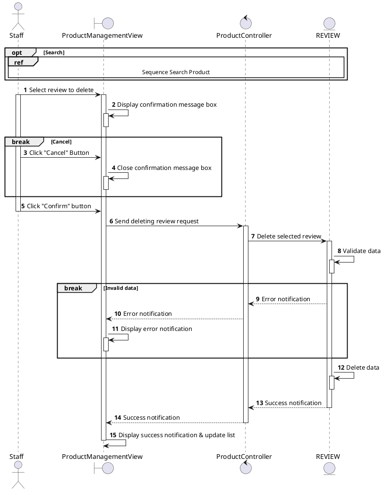

# Sequence Delete Review

```plantuml
@startuml
autonumber

actor Staff as S
boundary ProductManagementView as PMV
control ProductController as PC
entity REVIEW as R

opt Search
  ref over S, R: Sequence Search Product
end
S -> PMV: Select review to delete
activate S
activate PMV
PMV -> PMV: Display confirmation message box
activate PMV
deactivate PMV
break Cancel
  S -> PMV: Click "Cancel" Button
  PMV -> PMV: Close confirmation message box
  activate PMV
  deactivate PMV
end
S -> PMV: Click "Confirm" button
deactivate S
PMV -> PC: Send deleting review request
activate PC
PC -> R: Delete selected review
activate R
R -> R: Validate data
activate R
deactivate R
break Invalid data
  PC <-- R: Error notification
  PMV <-- PC: Error notification
  PMV -> PMV: Display error notification
  activate PMV
  deactivate PMV
end
R -> R: Delete data
activate R
deactivate R
PC <-- R: Success notification
deactivate R
PMV <-- PC: Success notification
deactivate PC
PMV -> PMV: Display success notification & update list
deactivate PMV
deactivate S

@enduml
```

<!-- diagram id="sequence-manage-product-delete-review" -->
