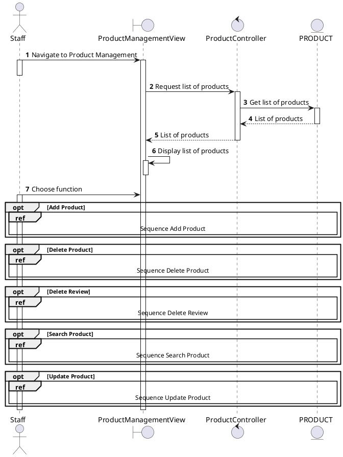

# Sequence Manage Product

```plantuml
@startuml
autonumber

actor Staff as S
boundary ProductManagementView as PMV
control ProductController as PC
entity PRODUCT as P

S -> PMV: Navigate to Product Management
activate S
activate PMV
deactivate S
PMV -> PC: Request list of products
activate PC
PC -> P: Get list of products
activate P
PC <-- P: List of products
deactivate P
PMV <-- PC: List of products
deactivate PC
PMV -> PMV: Display list of products
activate PMV
deactivate PMV

S -> PMV: Choose function
activate S

opt Add Product
  ref over S, P: Sequence Add Product
end

opt Delete Product
  ref over S, P: Sequence Delete Product
end

opt Delete Review
  ref over S, P: Sequence Delete Review
end

opt Search Product
  ref over S, P: Sequence Search Product
end

opt Update Product
  ref over S, P: Sequence Update Product
end

deactivate PMV
deactivate S

@enduml
```

<!-- diagram id="sequence-manage-product-manage-product" -->
