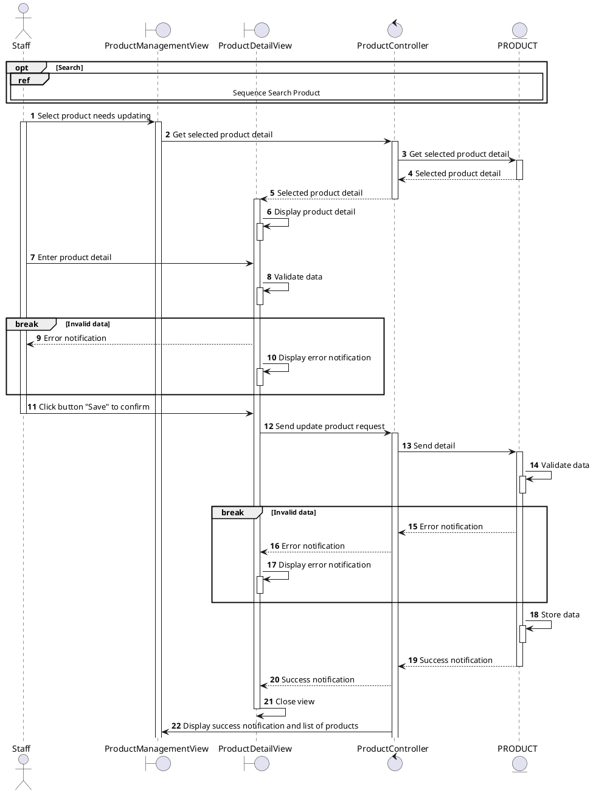

# Sequence Update Product

```plantuml
@startuml
autonumber

actor Staff as S
boundary ProductManagementView as PMV
boundary ProductDetailView as PDV
control ProductController as PC
entity PRODUCT as P

opt Search
  ref over S, P: Sequence Search Product
end
S -> PMV: Select product needs updating
activate S
activate PMV
PMV -> PC: Get selected product detail
activate PC
PC -> P: Get selected product detail
activate P
PC <-- P: Selected product detail
deactivate P
PDV <-- PC: Selected product detail
deactivate PC
activate PDV
PDV -> PDV: Display product detail
activate PDV
deactivate PDV
S -> PDV: Enter product detail
PDV -> PDV: Validate data
activate PDV
deactivate PDV
break Invalid data
  S <-- PDV: Error notification
  PDV -> PDV: Display error notification
  activate PDV
  deactivate PDV
end
S -> PDV: Click button "Save" to confirm
deactivate S
PDV -> PC: Send update product request
activate PC
PC -> P: Send detail
activate P
P -> P: Validate data
activate P
deactivate P
break Invalid data
  PC <-- P: Error notification
  PDV <-- PC: Error notification
  PDV -> PDV: Display error notification
  activate PDV
  deactivate PDV
end
P -> P: Store data
activate P
deactivate P
PC <-- P: Success notification
deactivate P
PDV <-- PC: Success notification
PDV -> PDV: Close view
deactivate PDV
PMV <- PC: Display success notification and list of products

@enduml
```

<!-- diagram id="sequence-manage-product-update-product" -->
