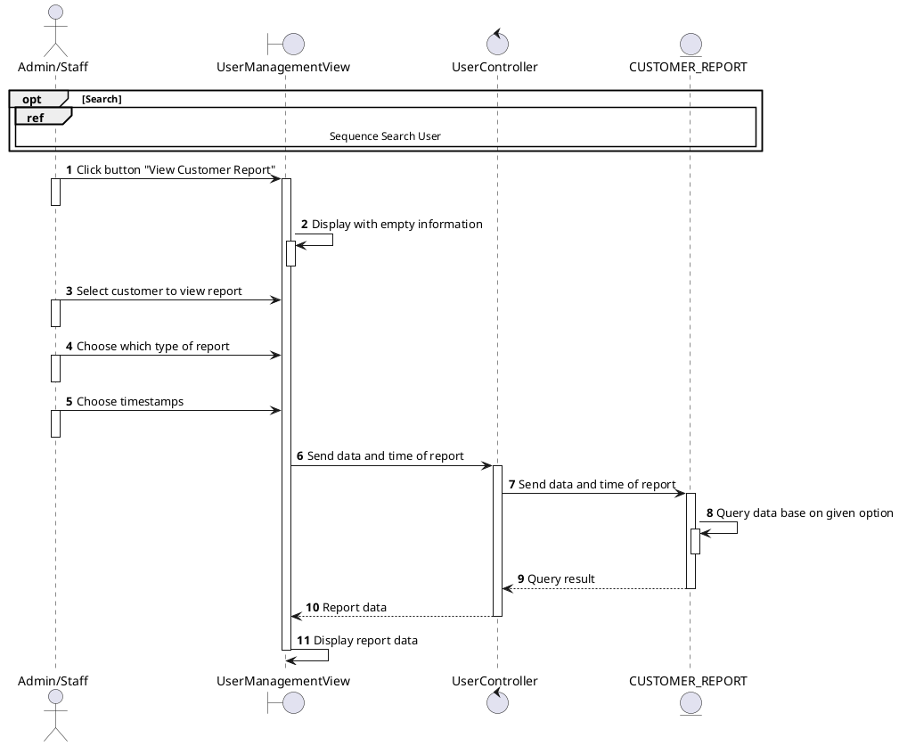

# Sequence View Customer Report

```plantuml
@startuml
autonumber

actor "Admin/Staff" as AS
boundary UserManagementView as UMV
control UserController as UC
entity CUSTOMER_REPORT as CR

opt Search
  ref over AS, CR: Sequence Search User
end
AS -> UMV: Click button "View Customer Report"
activate AS
activate UMV
deactivate AS
UMV -> UMV: Display with empty information
activate UMV
deactivate UMV
AS -> UMV: Select customer to view report
activate AS
deactivate AS
AS -> UMV: Choose which type of report
activate AS
deactivate AS
AS -> UMV: Choose timestamps
activate AS
deactivate AS
UMV -> UC: Send data and time of report
activate UC
UC -> CR: Send data and time of report
activate CR
CR -> CR: Query data base on given option
activate CR
deactivate CR
UC <-- CR: Query result
deactivate CR
UMV <-- UC: Report data
deactivate UC
UMV -> UMV: Display report data
deactivate UMV

@enduml
```

<!-- diagram id="sequence-manage-user-view-customer-report" -->
