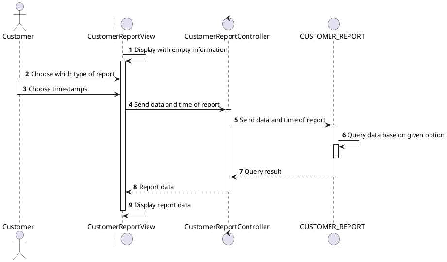

# Sequence View Customer Self Report

```plantuml
@startuml
autonumber

actor Customer as C
boundary CustomerReportView as CRV
control CustomerReportController as CRC
entity CUSTOMER_REPORT as CR

CRV -> CRV: Display with empty information
activate CRV
C -> CRV: Choose which type of report
activate C
C -> CRV: Choose timestamps
deactivate C
CRV -> CRC: Send data and time of report
activate CRC
CRC -> CR: Send data and time of report
activate CR
CR -> CR: Query data base on given option
activate CR
deactivate CR
CRC <-- CR: Query result
deactivate CR
CRV <-- CRC: Report data
deactivate CRC
CRV -> CRV: Display report data
deactivate CRV

@enduml
```

<!-- diagram id="sequence-view-customer-self-report-view-customer-self-report" -->
