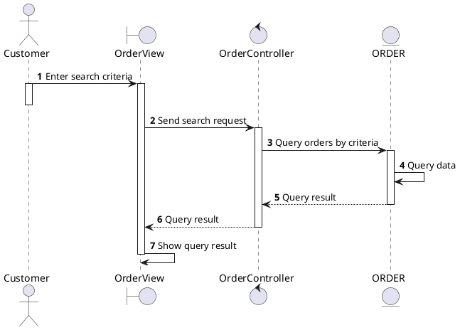

# Sequence Search Order

```plantuml
@startuml
autonumber

actor Customer as C
boundary OrderView as OV
control OrderController as OC
entity ORDER as O

C -> OV: Enter search criteria
activate C
activate OV
deactivate C
OV -> OC: Send search request
activate OC
OC -> O: Query orders by criteria
activate O
O -> O: Query data
OC <-- O: Query result
deactivate O
OV <-- OC: Query result
deactivate OC
OV -> OV: Show query result
deactivate OV

@enduml
```

<!-- diagram id="sequence-view-order-search-order" -->
