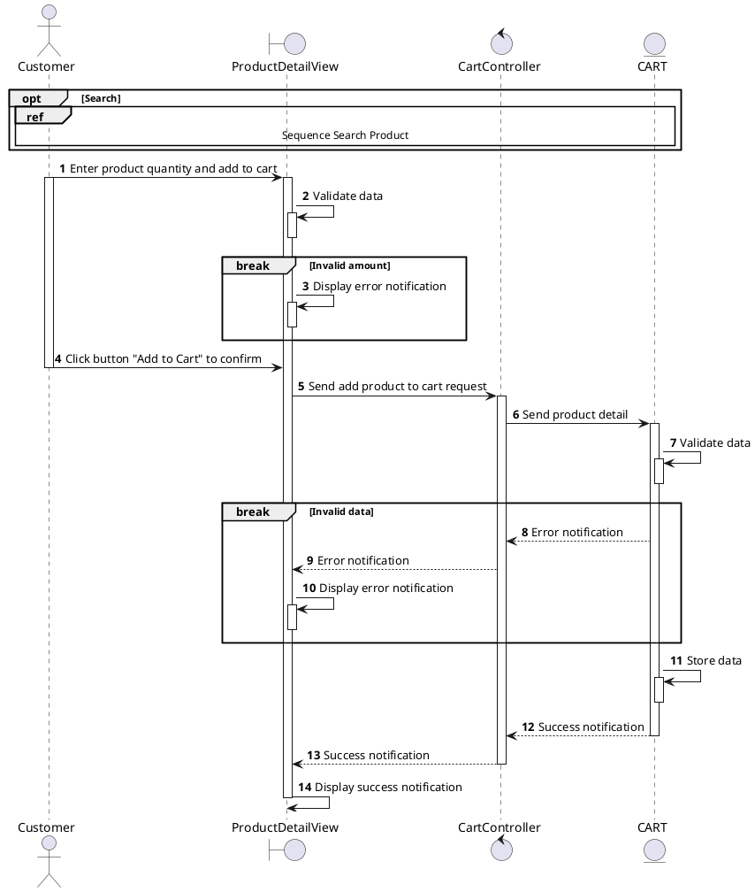

# Sequence Add Product to Cart

```plantuml
@startuml
autonumber

actor Customer as C
boundary ProductDetailView as PDV
control CartController as CC
entity CART as Ca

opt Search
  ref over C, Ca: Sequence Search Product
end
C -> PDV: Enter product quantity and add to cart
activate C
activate PDV
PDV -> PDV: Validate data
activate PDV
deactivate PDV
break Invalid amount
  PDV -> PDV: Display error notification
  activate PDV
  deactivate PDV
end
C -> PDV: Click button "Add to Cart" to confirm
deactivate C
PDV -> CC: Send add product to cart request
activate CC
CC -> Ca: Send product detail
activate Ca
Ca -> Ca: Validate data
activate Ca
deactivate Ca
break Invalid data
  CC <-- Ca: Error notification
  PDV <-- CC: Error notification
  PDV -> PDV: Display error notification
  activate PDV
  deactivate PDV
end
Ca -> Ca: Store data
activate Ca
deactivate Ca
CC <-- Ca: Success notification
deactivate Ca
PDV <-- CC: Success notification
deactivate CC
PDV -> PDV: Display success notification
deactivate PDV

@enduml
```

<!-- diagram id="sequence-view-product-add-product-to-cart" -->
