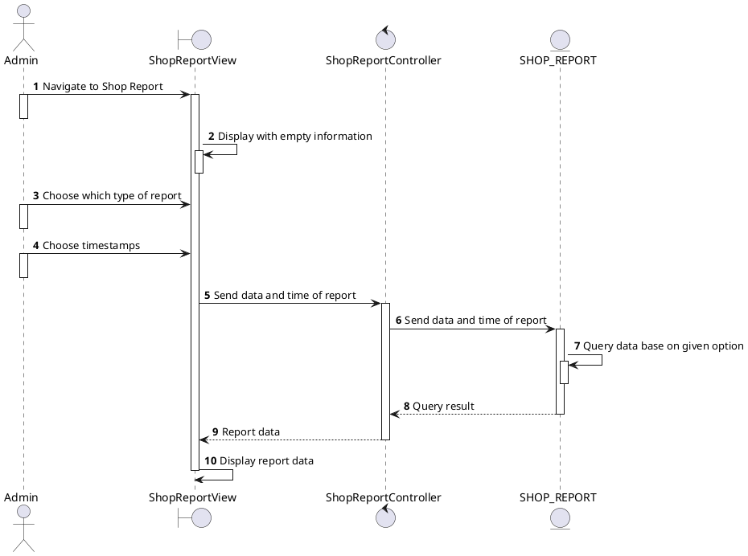

# Sequence View Shop Report

```plantuml
@startuml
autonumber

actor Admin as A
boundary ShopReportView as SRV
control ShopReportController as SRC
entity SHOP_REPORT as SR

A -> SRV: Navigate to Shop Report
activate A
activate SRV
deactivate A
SRV -> SRV: Display with empty information
activate SRV
deactivate SRV
A -> SRV: Choose which type of report
activate A
deactivate A
A -> SRV: Choose timestamps
activate A
deactivate A
SRV -> SRC: Send data and time of report
activate SRC
SRC -> SR: Send data and time of report
activate SR
SR -> SR: Query data base on given option
activate SR
deactivate SR
SRC <-- SR: Query result
deactivate SR
SRV <-- SRC: Report data
deactivate SRC
SRV -> SRV: Display report data
deactivate SRV

@enduml
```

<!-- diagram id="sequence-view-shop-report-view-shop-report" -->
