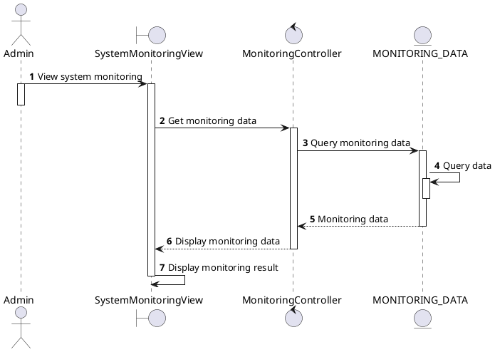

# Sequence View System Monitoring

```plantuml
@startuml
autonumber

actor Admin as A
boundary SystemMonitoringView as SMV
control MonitoringController as MC
entity MONITORING_DATA as MD

A -> SMV: View system monitoring
activate A
deactivate A
activate SMV
SMV -> MC: Get monitoring data
activate MC
MC -> MD: Query monitoring data
activate MD
MD -> MD: Query data
activate MD
deactivate MD
MC <-- MD: Monitoring data
deactivate MD
SMV <-- MC: Display monitoring data
deactivate MC
SMV -> SMV: Display monitoring result
deactivate SMV

@enduml
```

<!-- diagram id="sequence-view-system-monitoring-view-system-monitoring" -->
