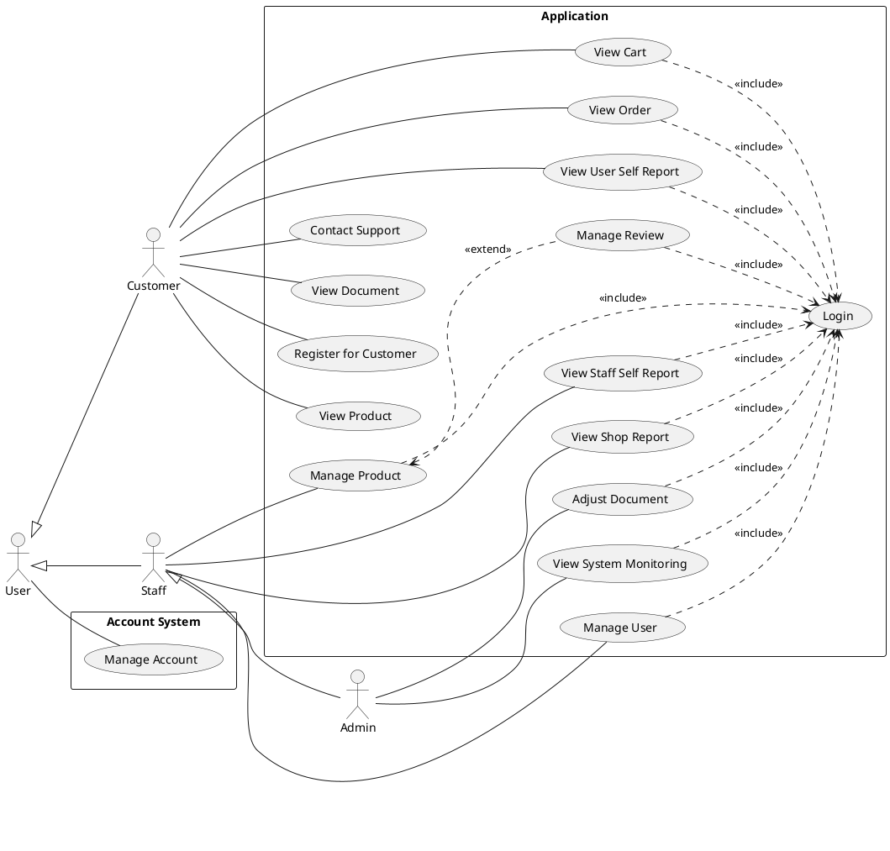

# Use Case Generic

```plantuml
@startuml
left to right direction
actor User
actor Customer
actor Staff
actor Admin

User <|-- Customer
User <|-- Staff
Staff <|-- Admin

rectangle "Account System" {
  usecase UC01 as "Manage Account"
}

rectangle "Application" {
  usecase UC02 as "Login"
  usecase UC03 as "Register for Customer"
  usecase UC04 as "View Product"
  usecase UC05 as "View Cart"
  usecase UC06 as "View Order"
  usecase UC07 as "Contact Support"
  usecase UC08 as "View User Self Report"
  usecase UC09 as "View Document"
  usecase UC10 as "Manage Product"
  usecase UC11 as "Manage Review"
  usecase UC12 as "Manage User"
  usecase UC13 as "View Staff Self Report"
  usecase UC14 as "View Shop Report"
  usecase UC15 as "View System Monitoring"
  usecase UC16 as "Adjust Document"
}

User -- UC01
Customer -- UC03
Customer -- UC04
Customer -- UC05
Customer -- UC06
Customer -- UC07
Customer -- UC08
Customer -- UC09
Staff -- UC10
Staff -- UC12
Staff -- UC13
Staff -- UC14
Admin -- UC15
Admin -- UC16

UC10 <.. UC11 : <<extend>>

UC05 ..> UC02 : <<include>>
UC06 ..> UC02 : <<include>>
UC08 ..> UC02 : <<include>>
UC10 ..> UC02 : <<include>>
UC11 ..> UC02 : <<include>>
UC12 ..> UC02 : <<include>>
UC13 ..> UC02 : <<include>>
UC14 ..> UC02 : <<include>>
UC15 ..> UC02 : <<include>>
UC16 ..> UC02 : <<include>>

@enduml
```

<!-- diagram id="use-case-generic" -->
